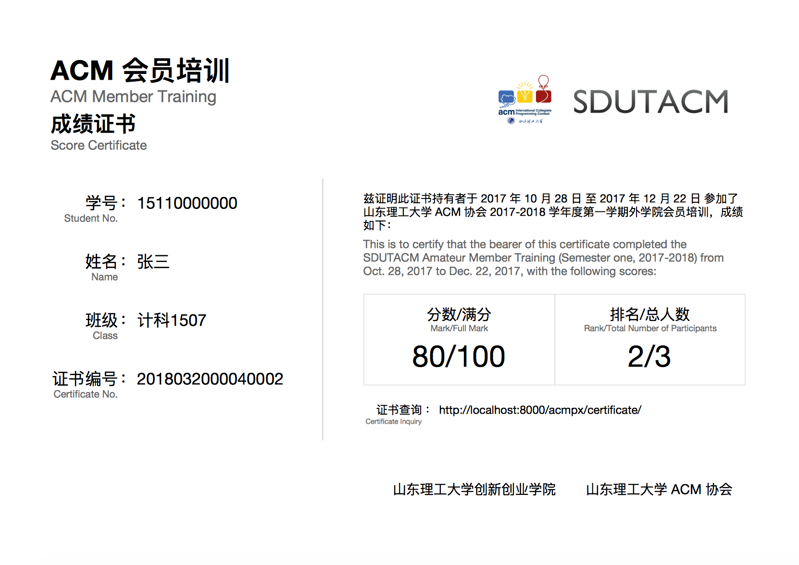
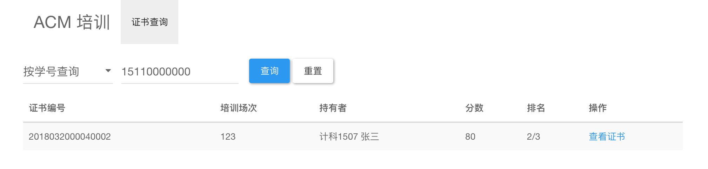
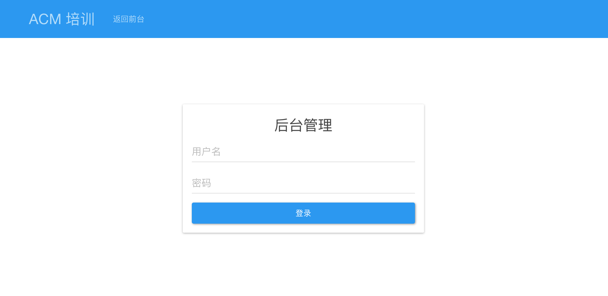
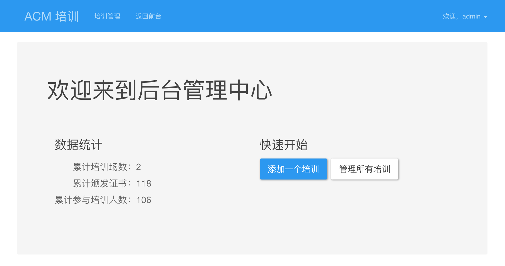
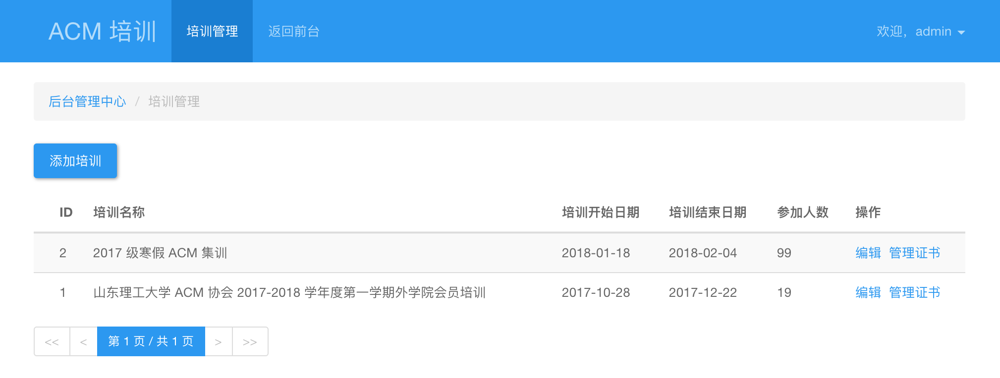
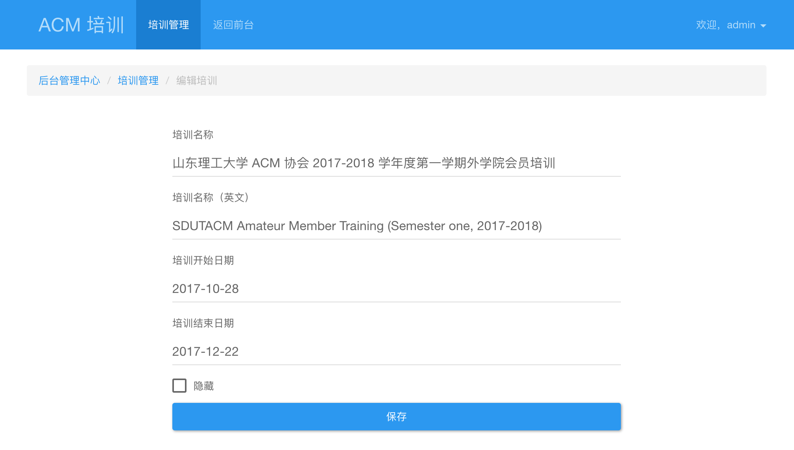
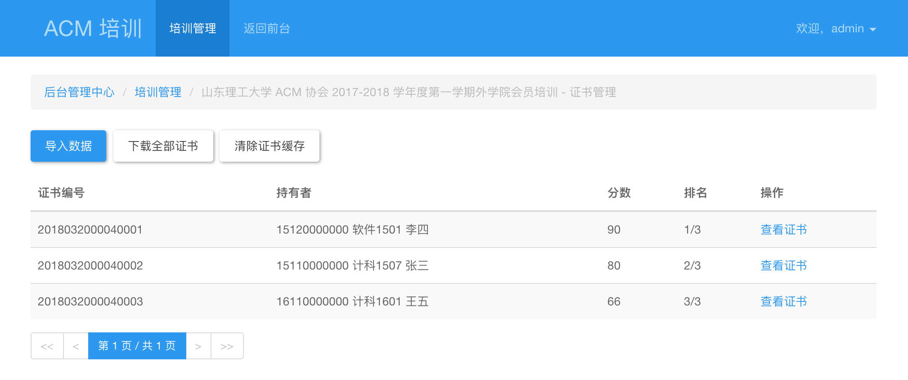
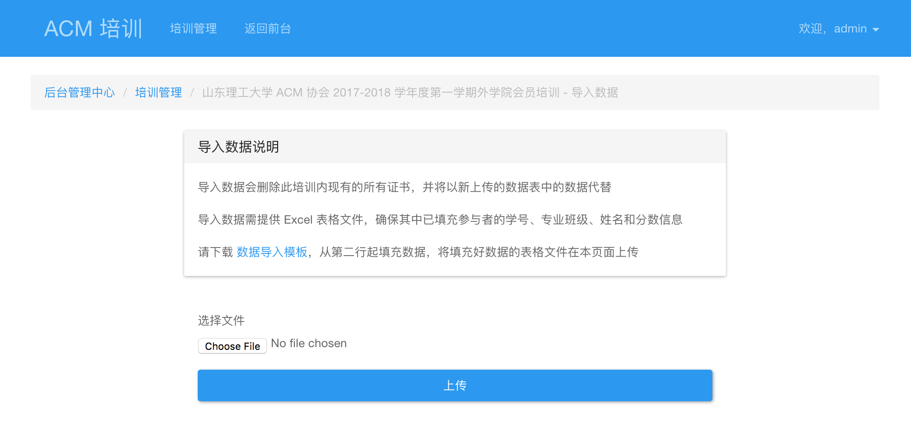

# acmpx_proj

山东理工大学 ACM 会员培训证书平台

------ 

支持批量导入培训成绩，生成 PDF 证书供查询和打印。

ACM 退役后写的第一个 Django 练手项目。已于年前上线，现搬运过来。

### 环境依赖

Python 包：
- Django 2.0.x
- PyMySQL 0.8.0
- xlrd 1.1.0

命令行工具：
- [wkhtmltopdf](https://wkhtmltopdf.org/) 0.12.3

数据库：
- MySQL

### 运行前配置

1. MySQL 建立数据库 `acmpx`
2. 将 `acmpx_proj` 目录下的 `settings.default.py` 复制一份为 `settings.py`，修改其中的数据库配置
3. 运行 `python3 manage.py migrate` 创建数据表
4. 运行 `python3 manage.py createsuperuser` 创建管理员帐号

### 运行

#### 调试

运行 `python3 manage.py runserver`，通过 `http://localhost:8000/acmpx/` 访问。

#### 部署

1. 设置 `settings.py` 中的 `DEBUG` 为 `True`
2. 设置 `settings.py` 中的 `ALLOWED_HOSTS`，添加允许访问的 hosts
3. 设置 `settings.py` 中的 `BASE_URL` 为实际部署后供访问的域名 URL
4. 运行 `python3 manage.py collectstatic` 生成静态资源文件
5. 通过 WSGI 部署
6. 为 `static` 和 `media` 目录配置 Web 访问，路径在 `/acmpx/` 下

### 访问

前台：`YOUR_BASE_URL/acmpx/`

后台：`YOUR_BASE_URL/acmpx/admin/`

### UI 支持

- [Bootstrap](http://getbootstrap.com/)
- [Bootswatch](https://bootswatch.com/3/paper/)
- [Font Awesome](https://fontawesome.com/)

### 截图

证书 PDF：

证书查询：

后台登录：

后台：

后台-培训管理：

后台-编辑培训：

后台-培训证书：

后台-培训证书上传：

